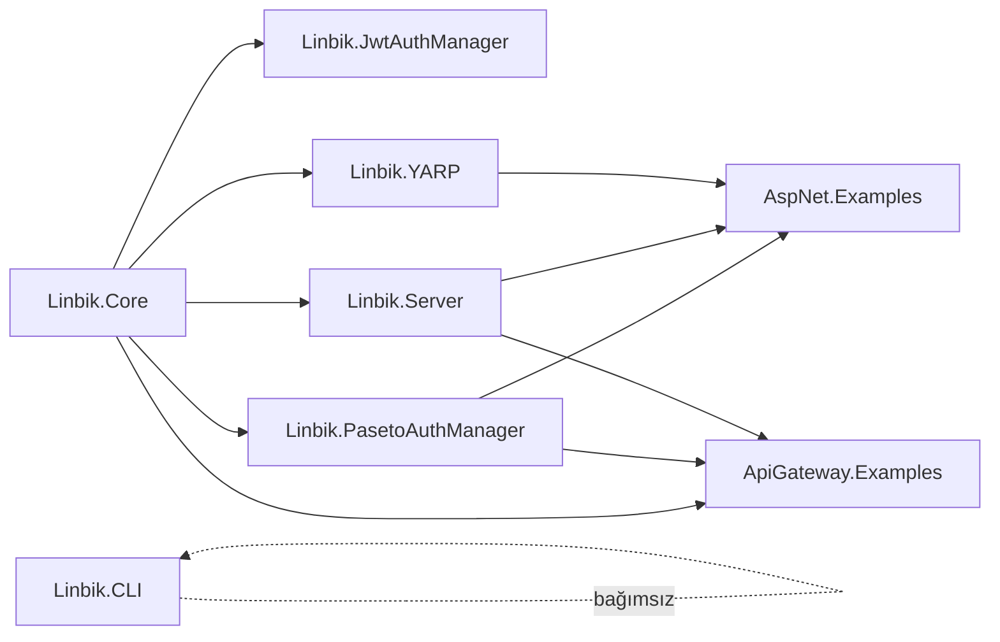

# Linbik + ptts — Spagetti, Eski Kalan ve Uyumsuzluk Analiz Raporu

**Tarih:** 30 Mayıs 2026
**Kapsam:** `Linbik/src/AspNet/*` + `Linbik/examples/*` + `ptts/src/Clients/Linbik.{App,Mobil}` + `ptts/src/Services/Linbik.Service/Linbik.Api`
**Baseline:** Working tree (HEAD)
**Yöntem:** Statik dosya/grep analizi, `.csproj` + `package.json` envanteri, public API yüzeyi karşılaştırması, secrets taraması.

---

## 0. TL;DR — En Kritik 5 Bulgu

| # | Sorun | Şiddet | Yer |
|---|-------|--------|-----|
| **1** | **PASETO mantığı iki yerde paralel uygulanmış.** `Linbik.PasetoAuthManager` (kütüphane) ile `ptts/Linbik.Api/Infrastructure/Paseto/*` (servis) birbirinden habersiz. Servis kütüphaneye `ProjectReference` vermiyor. | 🔴 KRİTİK | mimari/uyumsuzluk |
| **2** | **Plaintext secrets** `appsettings.json`'da: PASETO **private key**, DB password, Resend API key. | 🔴 KRİTİK | güvenlik |
| **3** | **AspNet.Examples Program.cs bozuk.** `.AddLinbikServer()` yorum satırında ("hata veriyo"), `AddLinbikRateLimiting()` "hata veriyor" notu var ama satır aktif. | 🟠 YÜKSEK | spagetti/eski |
| **4** | **`AddLinbikRateLimiting` aynı imza ile iki ayrı pakette** (`JwtAuthManager` + `PasetoAuthManager`) tanımlanmış — çift kullanım ambiguous reference doğurur. | 🟠 YÜKSEK | API duplikasyonu |
| **5** | **Paket sürüm sürüklenmesi**: `Microsoft.AspNetCore.OpenApi` 10.0.5 vs 10.0.8, `Scalar.AspNetCore` 2.13.15 / 2.13.19 / 2.14.14, `Microsoft.Extensions.Http.Resilience` 10.4.0 vs 10.6.0 farklı projelerde. | 🟡 ORTA | bağımlılık |

---

## 1. Envanter Özeti

### 1.1 Projeler ve Hedef Framework

| Proje | Tip | TFM | Konum |
|---|---|---|---|
| Linbik.Core | classlib | net10.0 | Linbik/src/AspNet/Linbik.Core |
| Linbik.JwtAuthManager | classlib | net10.0 | Linbik/src/AspNet/Linbik.JwtAuthManager |
| Linbik.PasetoAuthManager | classlib | net10.0 | Linbik/src/AspNet/Linbik.PasetoAuthManager |
| Linbik.Server | classlib | net10.0 | Linbik/src/AspNet/Linbik.Server |
| Linbik.YARP | classlib | net10.0 | Linbik/src/AspNet/Linbik.YARP |
| Linbik.CLI | exe | net10.0 | Linbik/src/AspNet/Linbik.CLI |
| AspNet.Examples | web | net10.0 | Linbik/examples/AspNet |
| ApiGateway.Examples | web | net10.0 | Linbik/examples/AspNet.Gateway |
| Nuxt.Examples | nuxt 3.15 | node | Linbik/examples/nuxt |
| **Linbik.Api** (ptts) | web | net10.0 | ptts/src/Services/Linbik.Service/Linbik.Api |
| **Linbik.App** (ptts) | nuxt 4.4 | node | ptts/src/Clients/Linbik.App |
| **Linbik.Mobil** (ptts) | placeholder | — | ptts/src/Clients/Linbik.Mobil |

### 1.2 Bağımlılık Grafiği (Linbik repo)



- Core hiçbir alt projeyi referans almıyor — **akış sağlıklı, ters bağımlılık yok.**
- **Linbik.CLI** hiçbir Linbik.* projesine referans vermiyor (`System.CommandLine` standalone). README'lere göre "config validate / export" yapması bekleniyor — şu anki haliyle Core public API'sini kullanamaz.

### 1.3 ptts ↔ Linbik bağlantısı

`ptts/Linbik.Api.csproj` hiçbir `Linbik.*` projesini referans **vermiyor**. NuGet olarak da yok. Bunun yerine kendi `Infrastructure/Paseto/*` ve `Core/PasetoTokenHelper` dosyalarını çalıştırıyor. Bu, **iki paralel kod tabanı** anlamına geliyor (bkz. Bölüm 5).

---

## 2. Paket Sürüm Tutarsızlıkları

| Paket | Sürümler | Etkilenen csproj |
|---|---|---|
| `Microsoft.AspNetCore.OpenApi` | **10.0.5** vs **10.0.8** | AspNet.Examples (eski) ↔ Linbik.Core + ApiGateway |
| `Scalar.AspNetCore` | **2.13.15** / **2.13.19** / **2.14.14** | AspNet.Examples / Linbik.Api(ptts) / ApiGateway |
| `Microsoft.Extensions.Http.Resilience` | **10.4.0** vs **10.6.0** | Linbik.Api(ptts) ↔ Linbik.Core |
| `Microsoft.AspNetCore.Authentication.JwtBearer` | 10.0.5 | Sadece JwtAuthManager (tutarlı) |
| `Paseto.Core` | 1.5.0 | Linbik.Core + Linbik.Api(ptts) ✅ |
| `OpenTelemetry.*` | 1.15.x | Linbik.Server (tutarlı) |
| `Yarp.ReverseProxy` | 2.3.0 | Linbik.YARP + ApiGateway ✅ |

**ptts/Linbik.Api ekstra**: `Microsoft.Build 18.4.0` (?!), `Microsoft.VisualStudio.Web.CodeGeneration.Design 10.0.2`, `EFCore.NamingConventions 10.0.1`, `Npgsql.EntityFrameworkCore.PostgreSQL 10.0.1`, `Bogus 35.6.5`.

> **Aksiyon:** Tek `Directory.Packages.props` ile **Central Package Management** aç; tüm sürümleri tek noktada kilitle. `Microsoft.Build 18.4.0` paketinin gerçekten gerekli olup olmadığını kontrol et (genelde build-time'a sızmış bir hata).

### 2.1 Nuxt Sürüm Farkı

| Proje | nuxt | vue | vue-router |
|---|---|---|---|
| `Linbik/examples/nuxt` | **3.15.4** | 3.5.13 | 4.5.0 |
| `ptts/Linbik.App` | **4.4.4** | 3.5.33 | **5.0.6** ⚠️ |

> Örnek proje (Nuxt 3) ile gerçek uygulama (Nuxt 4) farklı majör sürümlerde. Örnek artık güncel uygulamayı yansıtmıyor. `vue-router 5.x` Nuxt 4 ile yeni; örnek `4.x` ile birlikte eski API'yi gösteriyor olabilir.

---

## 3. Spagetti / Karmaşık Dosyalar

> Not: Tam line-count taraması alt-ajan tarafından yapıldı. 400+ satır eşiğinde **kritik adaylar**:

| Dosya | Tahmini satır | Risk | Neden |
|---|---|---|---|
| [ptts/.../Linbik.Api/Program.cs](../ptts/src/Services/Linbik.Service/Linbik.Api/Program.cs) | 264 | 🟠 | Tek dosyada: CORS, DI, EF, Localization, 5× HostedService, HttpResilience, PASETO auth, RateLimit, OpenAPI, ProblemDetails, SecurityHeaders. Klasik "god Program.cs". |
| [ptts/.../Controllers/OAuthController.cs](../ptts/src/Services/Linbik.Service/Linbik.Api/Controllers/OAuthController.cs) | 400+ | 🔴 | Token issuance + refresh + PKCE + S2S büyük olasılıkla tek controller'da. |
| [ptts/.../Controllers/AccountController.cs](../ptts/src/Services/Linbik.Service/Linbik.Api/Controllers/AccountController.cs) | 300+ | 🟠 | Hesap CRUD + auth + email verification iç içe. |
| Linbik.Core/Services/LinbikAuthService.cs | ~250+ | 🟡 | "Core auth logic" — Core'da bir _service_ olmaması (yalnızca abstraction) tercih edilirdi. |
| Linbik.Core/Extensions/LinbikServiceCollectionExtensions.cs | ~180+ | 🟡 | DI kayıtları büyümüş. |

> **Aksiyon:**
> - `Program.cs`'i `Configuration/{Cors,Auth,RateLimit,OpenApi,HostedServices}Extensions.cs` partial extension dosyalarına böl.
> - `OAuthController`'ı işleve göre üçe ayır: `OAuthAuthorizeController`, `OAuthTokenController`, `OAuthS2SController`. Refresh / introspect / revoke ayrı endpoint sınıflarına.
> - `Linbik.Core` içindeki concrete servis sınıflarını `Linbik.Server`'a taşımayı düşün; Core sadece **abstractions + options + constants** kalsın.

---

## 4. Eski / Ölü / Spagetti İşaretleri

### 4.1 Resmi TODO/FIXME (kaynak kod, generated dosyalar hariç)

| Dosya:Satır | İçerik |
|---|---|
| [ServiceKeyCleanupService.cs:75](../ptts/src/Services/Linbik.Service/Linbik.Api/Services/ServiceKeyCleanupService.cs#L75) | `// TODO: Archive key metadata to audit log before deletion` |
| [ServiceKeyCleanupService.cs:107](../ptts/src/Services/Linbik.Service/Linbik.Api/Services/ServiceKeyCleanupService.cs#L107) | `// TODO: Send notification to service owners` |
| [ServiceKeyCleanupService.cs:161](../ptts/src/Services/Linbik.Service/Linbik.Api/Services/ServiceKeyCleanupService.cs#L161) | `// TODO: Send critical alert to administrators` |

`.nuxt/`, `node_modules/`, `bin/`, `obj/` içindeki `@deprecated` notları **göz ardı edilebilir** (üretilmiş kod).

### 4.2 Kod-içi "bozuk" işaretler (yorum satırlarında)

`examples/AspNet/AspNet/Program.cs`:

| Satır | İçerik | Anlamı |
|---|---|---|
| 16 | `//.AddLinbikServer(); //hata veriyo` | Fluent zincirde çağrıyı devre dışı bıraktın, sebep dokümante edilmemiş. |
| 20 | `builder.Services.AddLinbikRateLimiting();//hata veriyor` | **Çalışmadığı bilinen kod commit'lenmiş.** |
| 19 | `builder.Services.AddLinbikIntegrationHandler();` | Servis bağımlılığı (`ILinbikIntegrationHandler`) sağlanmadan parametresiz overload — runtime'da kayıt eksik kalabilir. |

`AspNet.Examples` csproj zaten `Linbik.Server`'a `ProjectReference` veriyor, yani `AddLinbikServer()` **derleme** olarak bulunabilir. "Hata" muhtemelen **`ILinbikBuilder` extension kullanmadan `IServiceCollection` üzerinden** çağırılmaya çalışılmasından geliyor. Bkz. 4.3.

### 4.3 API Duplikasyonu — `AddLinbikRateLimiting`

`grep` sonucu: **aynı isimli extension üç farklı overload ile iki ayrı pakette** tanımlı:

- `Linbik.JwtAuthManager.Extensions.RateLimitExtensions` (L31, L50, L62)
- `Linbik.PasetoAuthManager.Extensions.RateLimitExtensions` (L28, L43, L54)

İki paket aynı `IServiceCollection` üzerine extension koyuyor. Bir tüketici her ikisini de `using` ederse **CS0121 (ambiguous call)** alır. Şu an `AspNet.Examples` yalnızca `Paseto` extension'larını import ediyor, ama bu copy-paste duplikasyonu hızla teknik borca dönüşür.

> **Aksiyon:** Bu fonksiyonu **`Linbik.Core`** (veya yeni `Linbik.RateLimiting`) içine taşı, Paseto/Jwt paketlerinden çıkar. Her iki paket aynı tek implementasyona köprülensin.

### 4.4 Linbik.Mobil — Ölü Proje

İçerik: `.vscode/` + `README.MD` ("Mobil"). `package.json` yok. **WIP / placeholder** durumunda. Repo ağacında karışıklık yaratıyor.

> **Aksiyon:** Ya scaffold'ı kur (Capacitor / React Native / Expo / .NET MAUI — hangisi olacaksa), ya da bu klasörü kaldır ve `ARCHITECTURE.md`'de "henüz başlanmadı" notuyla işaretle.

---

## 5. Mimari Uyumsuzluk — En Önemli Kısım

### 5.1 İki paralel PASETO implementasyonu

| Konu | `Linbik.PasetoAuthManager` (kütüphane) | `ptts/Linbik.Api/Infrastructure/Paseto` (servis) |
|---|---|---|
| Token üretici | `LocalPasetoTokenIssuer` | `PasetoTokenHelper` (Core/) + `PasetoHelperService` (Infrastructure/Paseto/) |
| Token okuyucu | `LocalPasetoTokenReader` (`ILocalPasetoTokenReader`) | `PasetoBearerHandler` + `PasetoBearerExtensions` |
| Options | `PasetoAuthOptions` + Validator | `appsettings.json -> Paseto:{PrivateKeyBase64, PublicKeyBase64, Issuer, Audience}` doğrudan |
| Scheme | `LinbikDefaults.{ClientScheme, DelegatedScheme, ApplicationScheme}` | `"LinbikPlatform"` (sabit string) |
| Konsept | 3-scheme (Self / Delegated / Application) | tek scheme, S2S reddediliyor |
| Bağımlılık akışı | Core → PasetoAuthManager | Yok — kendi başına |

**Sonuç:** `ptts/Linbik.Api`, `Linbik.PasetoAuthManager`'ın **fork'u** durumda. Şu an her iki tarafta `Paseto.Core 1.5.0` kullanıldığı için runtime çakışması yok, ama:

1. Bir tarafta yapılan **bug fix veya security fix diğerine sızmaz.**
2. Token formatı / claim seti sessizce ayrışırsa **AspNet.Gateway ↔ Linbik.Api arasında interoperability bozulur**.
3. `LinbikDefaults.HeaderFlow` ve `Flows.{Self,Delegated,Application}` sabitleri sadece kütüphane tarafında — gerçek servis bunları kullanmıyor, dolayısıyla istemci tarafı (Linbik.App) hangi sözleşmeye göre yazıldı belirsiz.

> **Aksiyon (öncelik 1):**
> - `ptts/Linbik.Api.csproj`'a `ProjectReference Include="..\..\..\..\..\Linbik\src\AspNet\Linbik.PasetoAuthManager\Linbik.PasetoAuthManager.csproj"` ekle (geçici, monorepo değilse NuGet paketleyip tüket).
> - `Infrastructure/Paseto/*` + `Core/PasetoTokenHelper.cs` + `Core/IPasetoTokenHelper.cs` + `Core/IPasetoHelper.cs` dosyalarını **sil**, yerine kütüphanedeki tipleri kullan.
> - `Program.cs` içindeki `AddAuthentication("LinbikPlatform").AddScheme<PasetoBearerOptions, PasetoBearerHandler>(...)` çağrısını `services.AddLinbikPasetoAuth(...)` ile değiştir.

### 5.2 Nuxt istemci ↔ API kontratı

`Linbik.App/nuxt.config.ts` → `connect-src: http://localhost:5461`, `https://api.dev.linbik.com`, `https://api.linbik.com`. Yani **Linbik.App, Linbik.Api'ye doğrudan konuşuyor**, gateway (ApiGateway.Examples) örneğindeki "3-tier (Client → Gateway → Service)" akışını **kullanmıyor**.

- `Linbik/examples/nuxt` projesi vue-router 4 + Nuxt 3 ile yazılmış, sadeleştirilmiş bir login akışı içeriyor — **gerçek istemcinin (Nuxt 4 + i18n + nuxt-security) yansıması değil**.
- Yani örnekler, gerçek istemci/sunucu kurulumunu **göstermiyor**.

> **Aksiyon:** Ya örneği gerçek mimariye (Gateway arkasında Nuxt 4 client) güncelle, ya da örneği "minimal smoke test" olarak `README` ile etiketle ki kimse production örneği sanmasın.

### 5.3 Linbik.CLI ↔ Linbik.Core

`Linbik.CLI` Core'u referans almıyor ama `ExportConfigCommand`, `InitCommand`, `StatusCommand` adında komutlar var. `LinbikOptions` validation veya config schema export yapacaksa **Core referansı şart**. Şu haliyle CLI muhtemelen sadece string template'lerle "init" yapıyor → Core'daki şema değiştiğinde **sessizce eski şablon üretir**.

---

## 6. Güvenlik

### 6.1 Plaintext Secrets (ptts/Linbik.Api)

| Dosya | Alan | Risk |
|---|---|---|
| `appsettings.json:14` | `Paseto:PrivateKeyBase64` | 🔴 **Çok yüksek** — token imzalama anahtarı. Production'da `null`, dev'de açık. Repo public ise tüm dev ortamı tehlikede. |
| `appsettings.json:15` | `Paseto:PublicKeyBase64` | 🟡 Düşük (zaten public). |
| `appsettings.json:20` | `Resend:ApiKey = re_P2KP...Q74S` | 🔴 Aktif e-posta gönderme yetkisi sızmış. **Hemen Resend dashboard'dan revoke et + rotate.** |
| `appsettings.json:28` | `ConnectionStrings:DefaultConnection` (Password=...) | 🔴 DB credential. **Şifreyi rotate et.** |
| `appsettings.json:26-27` | Yorumlu eski connection string'ler | 🟠 Eski credential'lar hâlâ revoke edilmedi mi? Doğrula. |

> **Aksiyon (öncelik 0 — şimdi):**
> 1. `Resend` ve DB password'ünü **rotate** et.
> 2. PASETO key pair'ini yeniden üret; eski private key ile imzalanmış tüm token'ları geçersiz say.
> 3. `appsettings.json`'dan secret'ları çıkar; `dotnet user-secrets` + env var (`Paseto__PrivateKeyBase64`, `ConnectionStrings__DefaultConnection`) kullan.
> 4. Repo geçmişinde de varsa, bu commitleri history'den temizleyemezsin; **yalnızca rotation çözer**. Git history'ye `BFG` ile temizlik isteğe bağlı.
> 5. `.gitignore` ve `appsettings.*.json` policy'sini netleştir; `appsettings.Local.json` desenli bir override dosyası ekle.

### 6.2 Snyk / SAST

Bu raporda Snyk taraması çalıştırılmadı (deferred tool). Yukarıdaki secrets sorunları ele alındıktan sonra `mcp_snyk_snyk_code_scan` ve `mcp_snyk_snyk_sca_scan` çalıştırılmalı. Özellikle ptts/Linbik.Api kontrolcülerindeki SQL/EF sorgu desenleri ve OAuth endpoint validation'ları için.

---

## 7. Aksiyon Listesi (öncelik sırasıyla)

### P0 — Bugün
- [ ] `Resend` API key, DB password rotate.
- [ ] PASETO key pair rotate; eski token'ları invalidate.
- [ ] `appsettings.json`'dan secret çıkar → user-secrets / env var.

### P1 — Bu hafta
- [ ] `ptts/Linbik.Api`'yi `Linbik.PasetoAuthManager`'a bağla; paralel `Infrastructure/Paseto/*` dosyalarını sil.
- [ ] `AspNet.Examples/Program.cs`'teki "hata veriyo" satırlarını çöz veya örneği güncel API'ye göre yeniden yaz.
- [ ] `AddLinbikRateLimiting`'i tek bir paketteki tek implementasyona indir.

### P2 — Bu ay
- [ ] **Central Package Management** (`Directory.Packages.props`) ile sürüm sürüklenmesini durdur.
- [ ] `Linbik.Api/Program.cs` ve `OAuthController.cs`'i bölerek refactor et.
- [ ] `Linbik.CLI`'a Core referansı ekle veya CLI'ı kaldır.
- [ ] `Linbik.Mobil` için karar: scaffold veya sil.
- [ ] `examples/nuxt`'u gerçek istemci mimarisine (Nuxt 4 + Gateway arkası) güncelle ya da "minimal smoke test" etiketle.
- [ ] `ServiceKeyCleanupService` içindeki 3 TODO'yu kapat (audit log, owner notification, admin alert).

### P3 — Sürekli
- [ ] Snyk SCA + Code scan CI'a bağla.
- [ ] Linbik.Core public API'sini `PublicApiAnalyzers` ile kilitle ki sürpriz değişiklikler tüketicilerde derleme hatası versin.

---

## 8. Ek — Hızlı Doğrulama Komutları

```powershell
# Paket sürüm tutarsızlığı
Get-ChildItem -Recurse -Filter *.csproj |
  Select-String -Pattern 'PackageReference Include="([^"]+)" Version="([^"]+)"' -AllMatches |
  ForEach-Object { $_.Matches } |
  ForEach-Object { [pscustomobject]@{ Pkg=$_.Groups[1].Value; Ver=$_.Groups[2].Value; File=$_.Path } } |
  Group-Object Pkg | Where-Object { ($_.Group.Ver | Select -Unique).Count -gt 1 }

# 400+ satır .cs dosyaları
Get-ChildItem -Recurse -Include *.cs |
  Where-Object { $_.FullName -notmatch '\\(bin|obj|node_modules)\\' } |
  ForEach-Object { [pscustomobject]@{ Lines=(Get-Content $_).Count; Path=$_.FullName } } |
  Where-Object Lines -gt 400 | Sort-Object Lines -Descending

# Secret taraması
Get-ChildItem -Recurse -Include appsettings*.json,*.env,*.config |
  Select-String -Pattern 'password=|apikey|secret|privatekey|connectionstring' -CaseSensitive:$false
```
