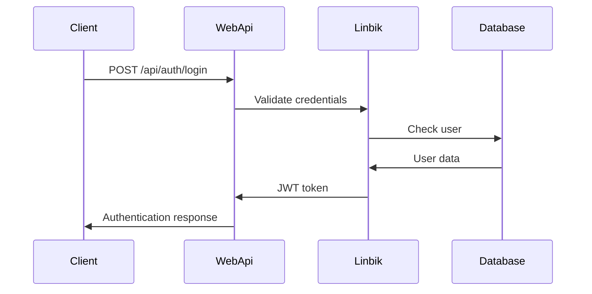

# Linbik.WebApi - Example Implementation

A complete example web API project demonstrating how to implement and use the Linbik Authentication Framework in a real-world application.

## 🚀 Overview

This project serves as a comprehensive example of how to integrate and use all Linbik components in a production-ready web API. It demonstrates best practices, proper configuration, and real-world usage patterns.

## 📦 Project Structure

```
Linbik.WebApi/
├── Controllers/           # API Controllers
│   ├── AuthController.cs  # Authentication endpoints
│   ├── UserController.cs  # User management
│   └── AppController.cs   # App authentication
├── Models/                # Data models
│   ├── LoginRequest.cs    # Login request model
│   ├── UserProfile.cs     # User profile model
│   └── ApiResponse.cs     # Standard API response
├── Services/              # Business logic services
│   ├── UserService.cs     # User operations
│   └── AuthService.cs     # Authentication logic
├── Middleware/            # Custom middleware
│   └── LoggingMiddleware.cs # Request logging
├── Program.cs             # Application entry point
├── appsettings.json       # Configuration
└── READMEnew.md           # This documentation
```

## 🔧 Prerequisites

- .NET 9.0 SDK
- Visual Studio 2022 or VS Code
- Basic understanding of ASP.NET Core
- Linbik packages (will be installed automatically)

## 🚀 Quick Start

### 1. Clone and Setup

```bash
git clone https://github.com/your-org/linbik.git
cd linbik/src/AspNet/Linbik.WebApi
dotnet restore
dotnet build
```

### 2. Configuration

Update `appsettings.json` with your settings:

```json
{
  "Logging": {
    "LogLevel": {
      "Default": "Information",
      "Microsoft.AspNetCore": "Warning"
    }
  },
  "AllowedHosts": "*",
  "Linbik": {
    "Version": "dev2025",
    "AppIds": ["webapi", "mobile", "desktop"],
    "AllowAllApp": false,
    "PublicKey": "your-public-key-here",
    "JwtAuth": {
      "PrivateKey": "your-jwt-secret-key",
      "PkceEnabled": true,
      "AccessTokenExpiration": 15,
      "RefreshTokenExpiration": 15
    },
    "Server": {
      "PrivateKey": "your-server-secret-key",
      "AccessTokenExpiration": 60
    }
  }
}
```

### 3. Run the Application

```bash
dotnet run
```

The API will be available at:
- **Swagger UI**: https://localhost:5001/swagger
- **API Base**: https://localhost:5001/api

## 🏗️ Architecture

### Dependency Injection Setup

```csharp
// Program.cs
var builder = WebApplication.CreateBuilder(args);

// Add Linbik Core
var linbikBuilder = builder.Services.AddLinbik(options =>
{
    options.Version = LinbikVersion.Dev2025;
    options.AppIds = new[] { "webapi", "mobile", "desktop" };
    options.AllowAllApp = false;
});

// Add JWT Authentication
linbikBuilder.AddJwtAuth(jwtOptions =>
{
    jwtOptions.PrivateKey = builder.Configuration["Linbik:JwtAuth:PrivateKey"];
    jwtOptions.PkceEnabled = true;
    jwtOptions.AccessTokenExpiration = 15;
    jwtOptions.RefreshTokenExpiration = 15;
});

// Add Server Authentication
linbikBuilder.AddLinbikServer(serverOptions =>
{
    serverOptions.PrivateKey = builder.Configuration["Linbik:Server:PrivateKey"];
    serverOptions.AccessTokenExpiration = 60;
});

// Add custom services
builder.Services.AddScoped<IUserService, UserService>();
builder.Services.AddScoped<IAuthService, AuthService>();
```

### Authentication Flow



## 📋 API Endpoints

### Authentication Endpoints

#### 1. User Login
```http
POST /api/auth/login
Content-Type: application/json

{
  "username": "john_doe",
  "password": "secure_password"
}
```

**Response:**
```json
{
  "isSuccess": true,
  "data": {
    "token": "eyJhbGciOiJIUzUxMiIsInR5cCI6IkpXVCJ9...",
    "user": {
      "id": "123e4567-e89b-12d3-a456-426614174000",
      "username": "john_doe",
      "firstName": "John",
      "lastName": "Doe",
      "email": "john@example.com"
    }
  }
}
```

#### 2. App Authentication
```http
POST /api/auth/app-login
Content-Type: application/json

{
  "appId": "123e4567-e89b-12d3-a456-426614174000",
  "key": "app-secret-key"
}
```

#### 3. Refresh Token
```http
POST /api/auth/refresh
Authorization: Bearer {refresh_token}
```

### User Management Endpoints

#### 1. Get User Profile
```http
GET /api/users/profile
Authorization: Bearer {access_token}
```

#### 2. Update User Profile
```http
PUT /api/users/profile
Authorization: Bearer {access_token}
Content-Type: application/json

{
  "firstName": "John",
  "lastName": "Smith",
  "email": "john.smith@example.com"
}
```

#### 3. Get All Users (Admin Only)
```http
GET /api/users
Authorization: Bearer {access_token}
```

## 🔐 Security Implementation

### JWT Token Validation

```csharp
[ApiController]
[Route("api/[controller]")]
[Authorize] // Requires valid JWT token
public class UserController : ControllerBase
{
    private readonly ICurrentActor _currentActor;
    private readonly IUserService _userService;
    
    public UserController(ICurrentActor currentActor, IUserService userService)
    {
        _currentActor = currentActor;
        _userService = userService;
    }
    
    [HttpGet("profile")]
    public async Task<IActionResult> GetProfile()
    {
        if (!_currentActor.IsAuthenticated)
            return Unauthorized();
            
        var userProfile = await _userService.GetUserProfileAsync(_currentActor.UserGuid.Value);
        return Ok(userProfile);
    }
}
```

### Role-Based Access Control

```csharp
[HttpGet("admin/users")]
[Authorize(Roles = "Admin")] // Role-based authorization
public async Task<IActionResult> GetAllUsers()
{
    var users = await _userService.GetAllUsersAsync();
    return Ok(users);
}
```

### Tenant Isolation

```csharp
[HttpGet("tenant-data")]
public async Task<IActionResult> GetTenantData()
{
    var tenantId = _currentActor.TenantId;
    
    // Tenant-specific data access
    var data = await _dataService.GetDataForTenantAsync(tenantId);
    
    return Ok(new
    {
        TenantId = tenantId,
        Data = data,
        UserType = _currentActor.UserType.ToString()
    });
}
```

## 🧪 Testing

### Unit Testing

```csharp
[TestFixture]
public class UserControllerTests
{
    private UserController _controller;
    private Mock<ICurrentActor> _mockCurrentActor;
    private Mock<IUserService> _mockUserService;
    
    [SetUp]
    public void Setup()
    {
        _mockCurrentActor = new Mock<ICurrentActor>();
        _mockUserService = new Mock<IUserService>();
        _controller = new UserController(_mockCurrentActor.Object, _mockUserService.Object);
    }
    
    [Test]
    public async Task GetProfile_AuthenticatedUser_ReturnsProfile()
    {
        // Arrange
        var userGuid = Guid.NewGuid();
        _mockCurrentActor.Setup(x => x.IsAuthenticated).Returns(true);
        _mockCurrentActor.Setup(x => x.UserGuid).Returns(userGuid);
        
        var expectedProfile = new UserProfile { Id = userGuid, Username = "testuser" };
        _mockUserService.Setup(x => x.GetUserProfileAsync(userGuid))
            .ReturnsAsync(expectedProfile);
        
        // Act
        var result = await _controller.GetProfile();
        
        // Assert
        var okResult = result as OkObjectResult;
        Assert.IsNotNull(okResult);
        Assert.AreEqual(expectedProfile, okResult.Value);
    }
}
```

### Integration Testing

```csharp
[TestFixture]
public class AuthenticationIntegrationTests
{
    private WebApplicationFactory<Program> _factory;
    private HttpClient _client;
    
    [SetUp]
    public void Setup()
    {
        _factory = new WebApplicationFactory<Program>();
        _client = _factory.CreateClient();
    }
    
    [Test]
    public async Task Login_ValidCredentials_ReturnsToken()
    {
        // Arrange
        var loginRequest = new LoginRequest
        {
            Username = "testuser",
            Password = "testpass"
        };
        
        // Act
        var response = await _client.PostAsJsonAsync("/api/auth/login", loginRequest);
        
        // Assert
        Assert.IsTrue(response.IsSuccessStatusCode);
        
        var result = await response.Content.ReadFromJsonAsync<ApiResponse<LoginResponse>>();
        Assert.IsTrue(result.IsSuccess);
        Assert.IsNotNull(result.Data.Token);
    }
}
```

## 🔧 Customization Examples

### Custom Middleware

```csharp
public class LoggingMiddleware
{
    private readonly RequestDelegate _next;
    private readonly ILogger<LoggingMiddleware> _logger;
    
    public LoggingMiddleware(RequestDelegate next, ILogger<LoggingMiddleware> logger)
    {
        _next = next;
        _logger = logger;
    }
    
    public async Task InvokeAsync(HttpContext context)
    {
        var startTime = DateTime.UtcNow;
        
        try
        {
            await _next(context);
        }
        finally
        {
            var duration = DateTime.UtcNow - startTime;
            _logger.LogInformation(
                "Request {Method} {Path} completed in {Duration}ms with status {StatusCode}",
                context.Request.Method,
                context.Request.Path,
                duration.TotalMilliseconds,
                context.Response.StatusCode);
        }
    }
}
```

### Custom Authentication Handler

```csharp
public class CustomAuthenticationHandler : AuthenticationHandler<AuthenticationSchemeOptions>
{
    private readonly ITokenValidator _tokenValidator;
    
    public CustomAuthenticationHandler(
        IOptionsMonitor<AuthenticationSchemeOptions> options,
        ILoggerFactory logger,
        UrlEncoder encoder,
        ISystemClock clock,
        ITokenValidator tokenValidator)
        : base(options, logger, encoder, clock)
    {
        _tokenValidator = tokenValidator;
    }
    
    protected override async Task<AuthenticateResult> HandleAuthenticateAsync()
    {
        var token = Request.Headers["Authorization"].FirstOrDefault()?.Split(" ").Last();
        
        if (string.IsNullOrEmpty(token))
            return AuthenticateResult.Fail("Token not provided");
        
        var validationResult = await _tokenValidator.ValidateToken(token, "", false);
        
        if (!validationResult.Success)
            return AuthenticateResult.Fail("Invalid token");
        
        var claims = validationResult.Claims;
        var identity = new ClaimsIdentity(claims, Scheme.Name);
        var principal = new ClaimsPrincipal(identity);
        var ticket = new AuthenticationTicket(principal, Scheme.Name);
        
        return AuthenticateResult.Success(ticket);
    }
}
```

## 📊 Monitoring and Logging

### Structured Logging

```csharp
public class AuthService
{
    private readonly ILogger<AuthService> _logger;
    
    public async Task<LoginResponse> LoginAsync(LoginRequest request)
    {
        _logger.LogInformation("Login attempt for user {Username}", request.Username);
        
        try
        {
            // Authentication logic
            var result = await AuthenticateUserAsync(request);
            
            _logger.LogInformation("User {Username} logged in successfully", request.Username);
            return result;
        }
        catch (Exception ex)
        {
            _logger.LogError(ex, "Login failed for user {Username}", request.Username);
            throw;
        }
    }
}
```

### Performance Monitoring

```csharp
[HttpGet("performance-test")]
public async Task<IActionResult> PerformanceTest()
{
    var stopwatch = Stopwatch.StartNew();
    
    // Simulate some work
    await Task.Delay(100);
    
    stopwatch.Stop();
    
    _logger.LogInformation("Performance test completed in {ElapsedMs}ms", stopwatch.ElapsedMilliseconds);
    
    return Ok(new { ElapsedMs = stopwatch.ElapsedMilliseconds });
}
```

## 🚀 Deployment

### Docker Support

```dockerfile
FROM mcr.microsoft.com/dotnet/aspnet:9.0 AS base
WORKDIR /app
EXPOSE 80
EXPOSE 443

FROM mcr.microsoft.com/dotnet/sdk:9.0 AS build
WORKDIR /src
COPY ["Linbik.WebApi.csproj", "./"]
RUN dotnet restore "Linbik.WebApi.csproj"
COPY . .
WORKDIR "/src/."
RUN dotnet build "Linbik.WebApi.csproj" -c Release -o /app/build

FROM build AS publish
RUN dotnet publish "Linbik.WebApi.csproj" -c Release -o /app/publish

FROM base AS final
WORKDIR /app
COPY --from=publish /app/publish .
ENTRYPOINT ["dotnet", "Linbik.WebApi.dll"]
```

### Environment Configuration

```bash
# Production environment variables
export ASPNETCORE_ENVIRONMENT=Production
export ASPNETCORE_URLS=http://+:80;https://+:443
export Linbik__JwtAuth__PrivateKey=your-production-key
export Linbik__Server__PrivateKey=your-production-server-key
```

## 📚 Best Practices Demonstrated

### 1. **Security**
- JWT token validation
- PKCE implementation
- Role-based authorization
- Tenant isolation
- Secure configuration

### 2. **Performance**
- Async/await patterns
- Efficient dependency injection
- Structured logging
- Performance monitoring

### 3. **Maintainability**
- Clean architecture
- Separation of concerns
- Comprehensive testing
- Clear documentation

### 4. **Scalability**
- Multi-tenant support
- Configurable authentication
- Extensible middleware
- Load balancing ready

## 🔍 Troubleshooting

### Common Issues

#### 1. **JWT Token Validation Fails**
```bash
# Check configuration
dotnet user-secrets list

# Verify private key format
# Ensure PKCE is properly configured
```

#### 2. **Authentication Not Working**
```bash
# Check service registration
dotnet run --environment Development

# Verify middleware order
# Check authorization attributes
```

#### 3. **Performance Issues**
```bash
# Monitor memory usage
dotnet-counters monitor

# Check logging levels
# Verify async patterns
```

## 📞 Support

### Getting Help

- **Documentation**: Check Linbik framework documentation
- **Issues**: Create GitHub issues for bugs
- **Examples**: Use this project as reference
- **Community**: Join Linbik discussions

### Contributing

1. Fork the repository
2. Create a feature branch
3. Make your changes
4. Add tests
5. Submit a pull request

---

**Linbik.WebApi** - A complete example of Linbik Authentication Framework implementation.

*Use this project as a reference for implementing Linbik in your own applications.*
